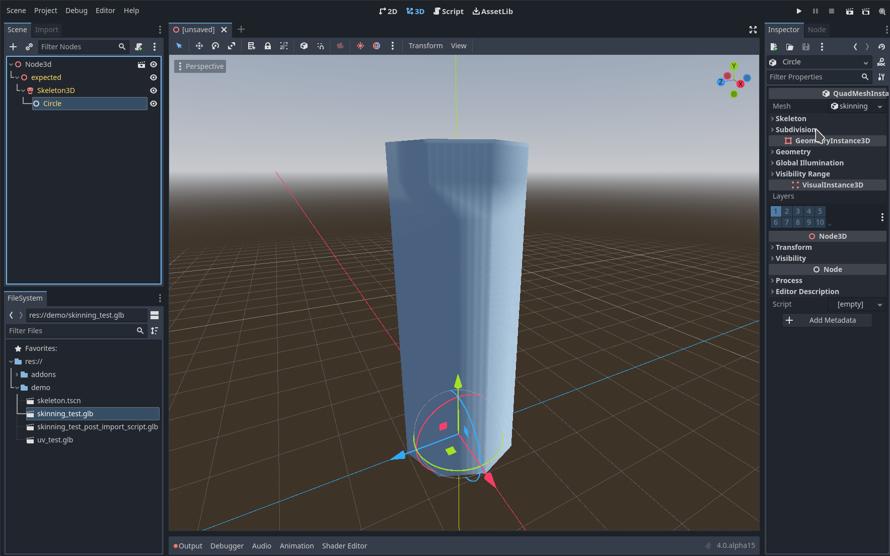

 
# Godot Subdiv

|  |  |
| ------------------------------------ | ------------------------------------------------ |

## Getting Started

For importing a QuadMesh you can select a glb/gltf file **that contained only quads before export** and either change the importer in the import settings to the custom Quad GLTF importer or select the [post import script](project/addons/godot_subdiv/quad_converter_post_import.gd) inside of the importer window.

After that you can just create an Inherited Scene and should see the custom QuadImporterMeshInstance
with a subdivison level editor setting. 

## FAQ

### How to create a mesh only containing Quads?

In Blender you can go in Edit Mode and go Select->Select All by Trait->Faces by Sides and set it to Not Equal To 4. After removing the then selected faces and replacing them with quads import will work.

## Acknowledgements

- [OpenSubdiv](https://github.com/PixarAnimationStudios/OpenSubdiv) files in [thirdparty/opensubdiv](thirdparty/opensubdiv) licensed under [Modified Apache 2.0](thirdparty/opensubdiv/LICENSE.txt)
- [Godot3 module for opensubdiv](https://github.com/godot-extended-libraries/godot-fire/tree/feature/3.2/opensubdiv-next) by fire that was referenced for subdivision implementation
- [Template used](https://github.com/nathanfranke/gdextension), includes the used github workflow and was easy to setup

## Last tested Godot version

[b9a64c77366361a0d45dcdd2b330911efd1eb3f4](https://github.com/godotengine/godot/commit/b9a64c77366361a0d45dcdd2b330911efd1eb3f4)
Couldn't use beta 1 build cause api changes (planning to release between beta 2 / 3, so don't see the point to adapt to a changed api)
## License

[MIT](LICENSE)
Thirdparty notices are in [THIRDPARTY.md](THIRDPARTY.md).
